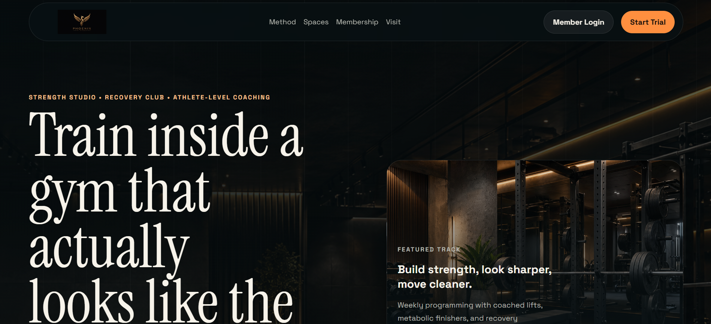
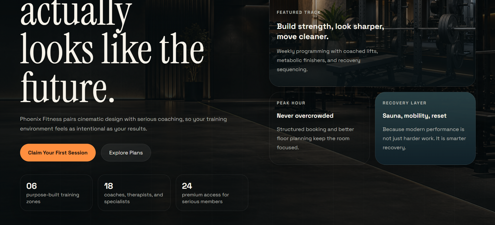
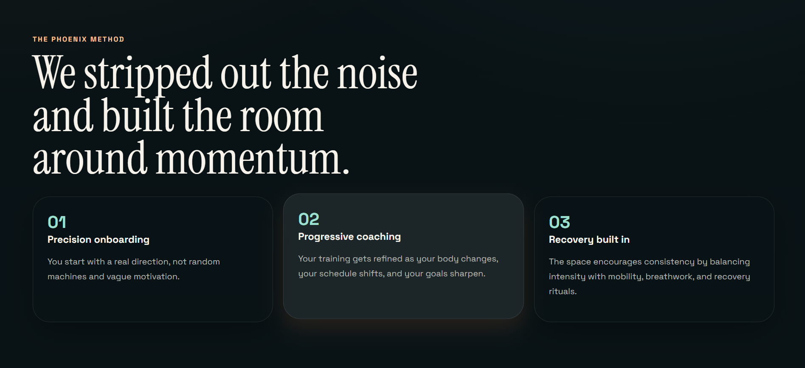
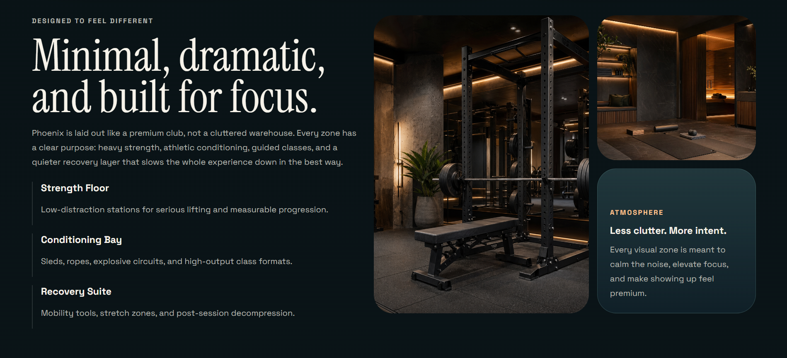
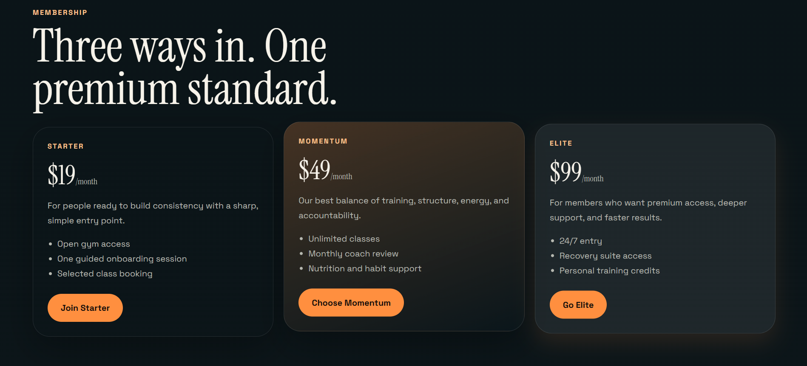
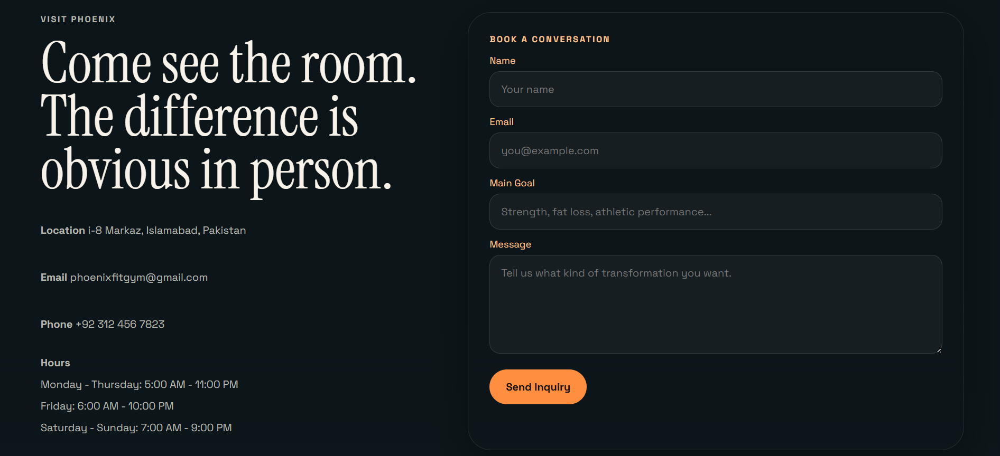
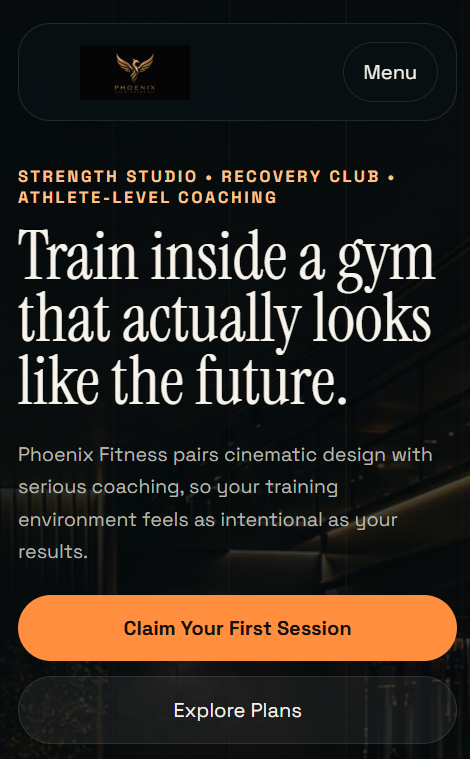
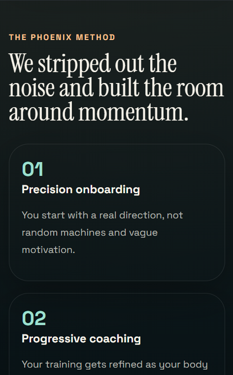

# Phoenix Fitness Website

A modern static gym website for **Phoenix Fitness** with a premium visual direction, responsive layout, and supporting membership/auth pages.

## Preview











## Project Structure

```
gym-management-site/
|-- index.html
|-- README.md
|-- assets/
|   |-- css/
|   |-- images/
|   `-- js/
`-- pages/
```

## Main Files

- `index.html`
  Main landing page of the website.

- `pages/membership.html`
  Membership details page.

- `pages/login.html`
  Login form page used inside the modal.

- `pages/signup.html`
  Signup form page used inside the modal.

- `pages/join.html`
  Free trial / join form used inside the modal.

## Assets

- `assets/css/main.css`
  Main styling for the homepage.

- `assets/css/membership.css`
  Styling for the membership page.

- `assets/css/portal.css`
  Styling for login, signup, and join pages.

- `assets/js/main.js`
  Navigation, modal, and form interaction logic.

- `assets/images/`
  Image assets used across the site, including generated premium visuals and the logo.

## How To Run

This is a static website, so no build step is required.

Open `index.html` directly in a browser, or serve the folder with a simple local server if you want cleaner routing and testing.

## Design Direction

The site is built around:

- premium fitness branding
- cinematic dark visuals
- modern editorial typography
- responsive sections and clean spacing
- minimal but polished interaction

## Notes

- The homepage is the main entry point.
- Secondary pages are grouped under `pages/` to keep the root clean.
- Styling and scripts are separated into `assets/` for easier maintenance.

## Author
Created by Subhan.

GitHub: https://github.com/Subhan46-web

LinkedIn: linkedin.com/in/subhanraza