# Phoenix Fitness Website

A modern static one-page gym website for **Phoenix Fitness** with a premium visual direction, responsive layout, a built-in membership section, and supporting auth pages.

## Preview

   ### Desktop View
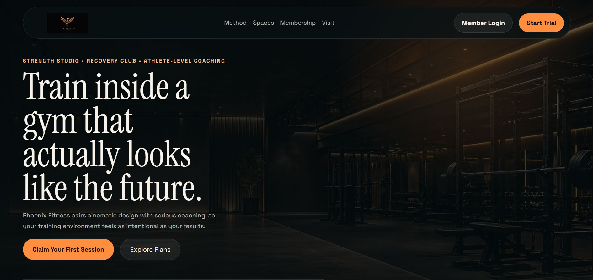
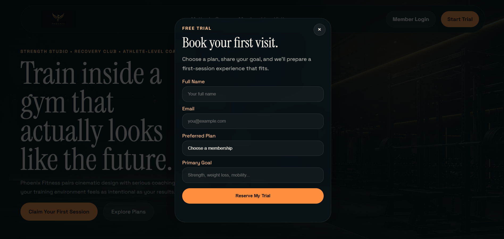
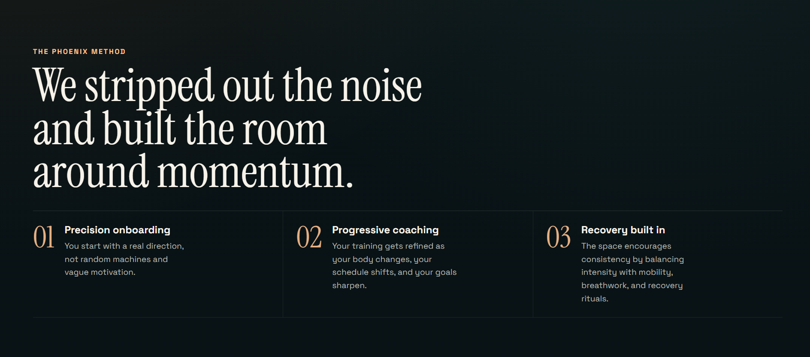
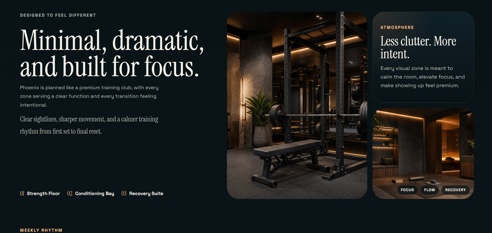
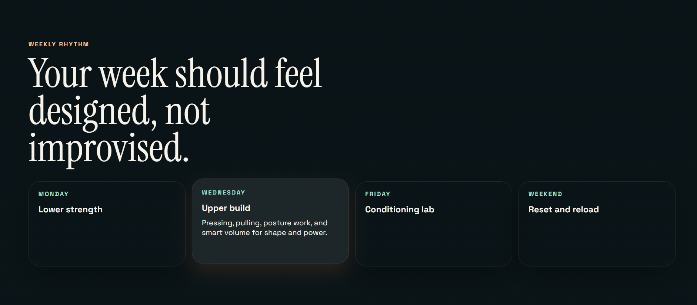
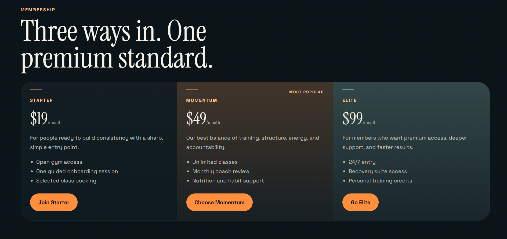
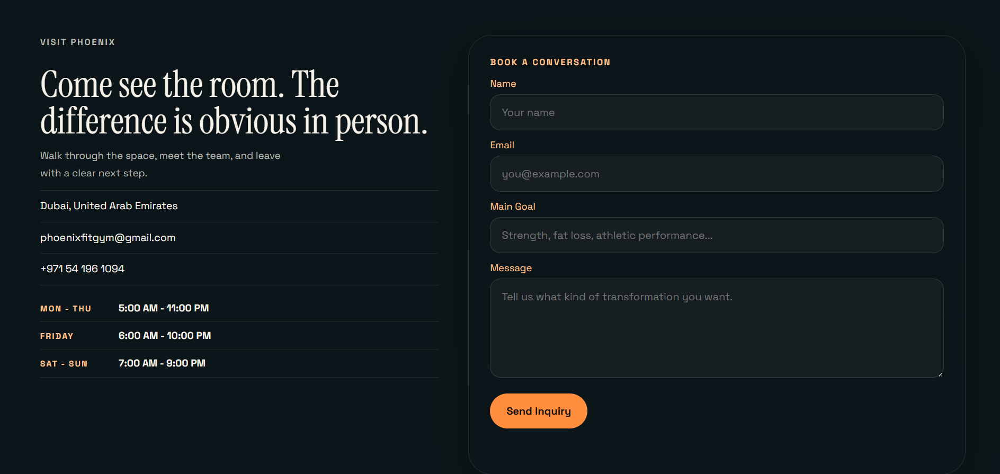
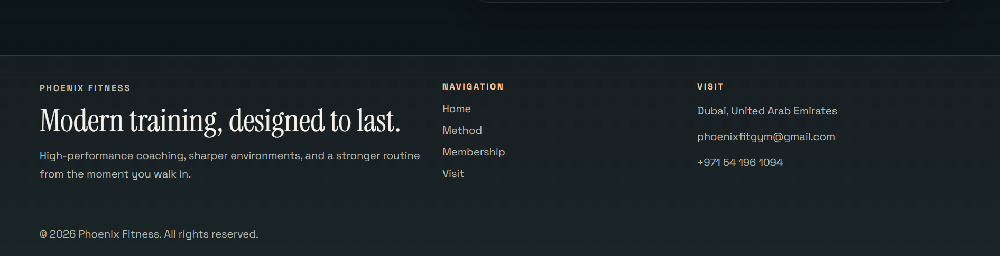

   ### Tablet View
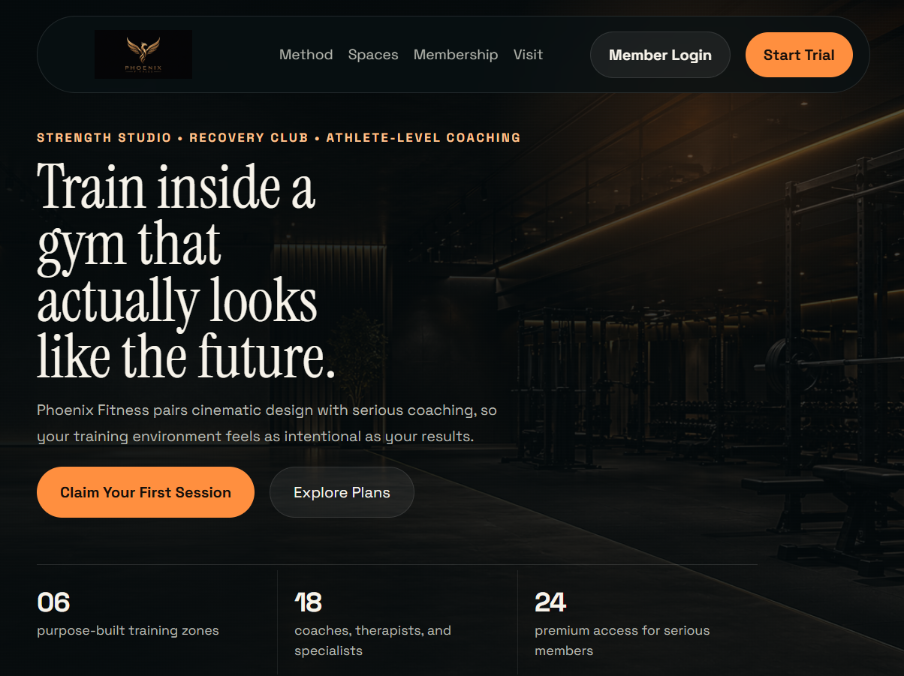
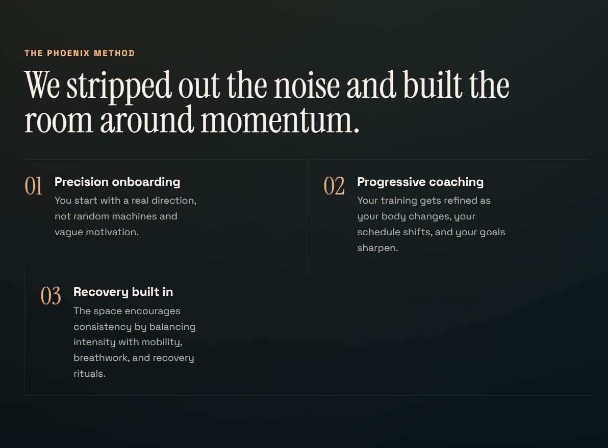
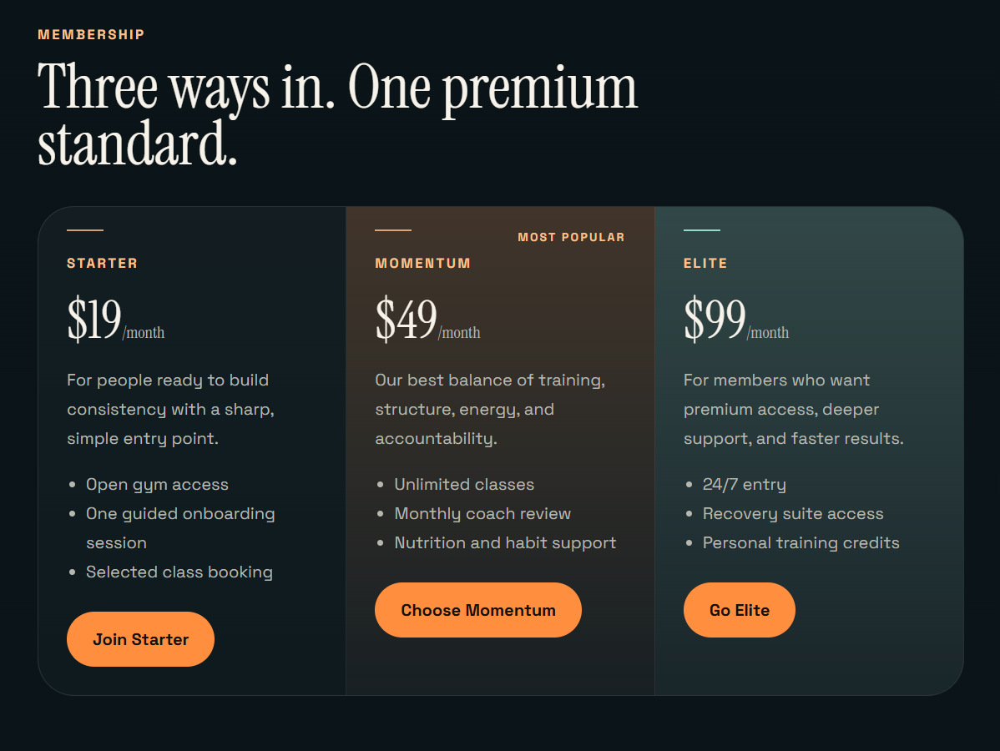
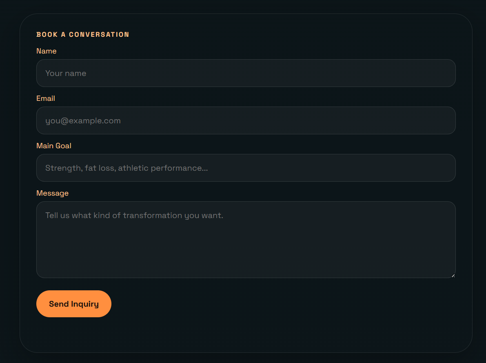

   ### Mobile View
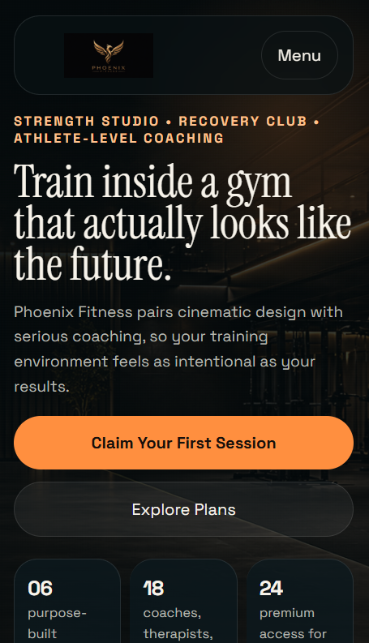
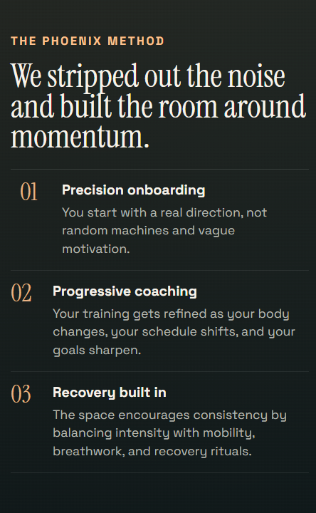
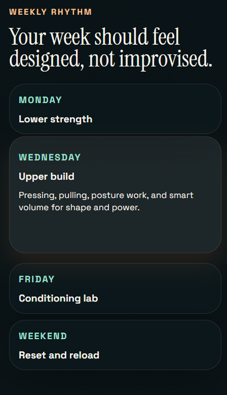
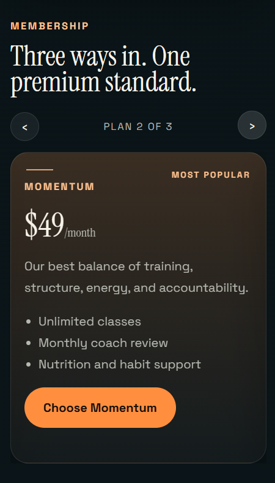

## Project Structure

```text
gym-management-site/
|-- index.html
|-- README.md
|-- assets/
|   |-- css/
|   |   |-- landing-page.css
|   |   `-- auth-modals.css
|   |-- images/
|   `-- js/
|       `-- landing-page.js
`-- pages/
    |-- member-login-modal.html
    |-- member-signup-modal.html
    `-- trial-booking-modal.html
```

## Main Files

- `index.html`
  Main landing page of the website, including membership and modal entry points.

- `pages/member-login-modal.html`
  Login form page used inside the modal.

- `pages/member-signup-modal.html`
  Signup form page used inside the modal.

- `pages/trial-booking-modal.html`
  Free trial / join form used inside the modal.

## Assets

- `assets/css/landing-page.css`
  Main styling for the homepage.

- `assets/css/auth-modals.css`
  Styling for login, signup, and join pages.

- `assets/js/landing-page.js`
  Navigation, smooth scrolling, modal, membership carousel, and form interaction logic.

- `assets/images/`
  Image assets used across the site, including generated premium visuals and the logo.

## How To Run

This is a static website, so no build step is required.

Open `index.html` directly in a browser, or serve the folder with a simple local server if you want cleaner routing and testing.

## Design Direction

The site is built around:

- premium fitness branding
- cinematic dark visuals
- modern editorial typography
- responsive sections and clean spacing
- minimal but polished interaction
- mobile-friendly membership carousel and plan browsing

## Notes

- The homepage is the main entry point and includes the membership section.
- Supporting modal pages are grouped under `pages/` and loaded into the homepage modals as needed.
- Styling and scripts are separated into `assets/` for easier maintenance.

## Author
Created by Subhan.

GitHub: https://github.com/Subhan46-web

LinkedIn: linkedin.com/in/subhanraza
